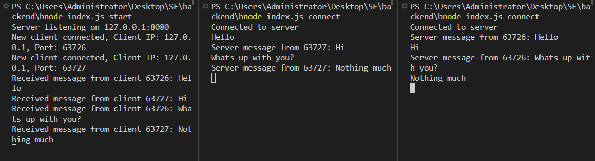

# Broadcast Server CLI Application

## Overview
A simple broadcast server that will allow clients to connect to it, send messages that will be broadcasted to all connected clients.

## Features
- Created a server that listens for incoming connections.
- When a client connects, store the connection in a list of connected clients.
- When a client sends a message, broadcast this message to all connected clients.
- Handled client disconnections and remove the client from the list of connected clients.
- Implemented a client that can connect to the server and send messages.
- Tested the server by connecting multiple clients and sending messages.
- Implement error handling and graceful shutdown of the server.


## Installation
To install and set up the Broadcast Server Application, follow these steps:

1. **Clone the repository**:
   ```bash
   git clone https://github.com/PhilipOyelegbin/backend/tree/master/broadcast-server.git
   ```

2. **Install dependencies**:
   ```bash
   npm install
   ```

## Usage
After installation, you can use the following commands to manage your broadcast server:

- **Start a new server**:
  ```javascript
  node index.js start
  ```
    or
  ```bash
  ./index.js start
  ```

- **Connect a client**:
  ```javascript
  node index.js connect
  ```
    or
  ```bash
  ./index.js connect
  ```

## Example
Here's an example of how to use the Broadcast Server CLI Application:

```bash
# Start a new server
./index.js start

# Open differrent terminals and connect a client on each using the command below
./index.js connect
```


## Contributing
Contributions are welcome! If you have any ideas, suggestions, or bug reports, please open an issue or submit a pull request.

## License
This project is licensed under the ISC License. See the [LICENSE](LICENSE) file for more details.

## Contact
For any questions or inquiries, please contact [contact@philipoyelegbin.com.ng](mailto:contact@philipoyelegbin.com.ng).
