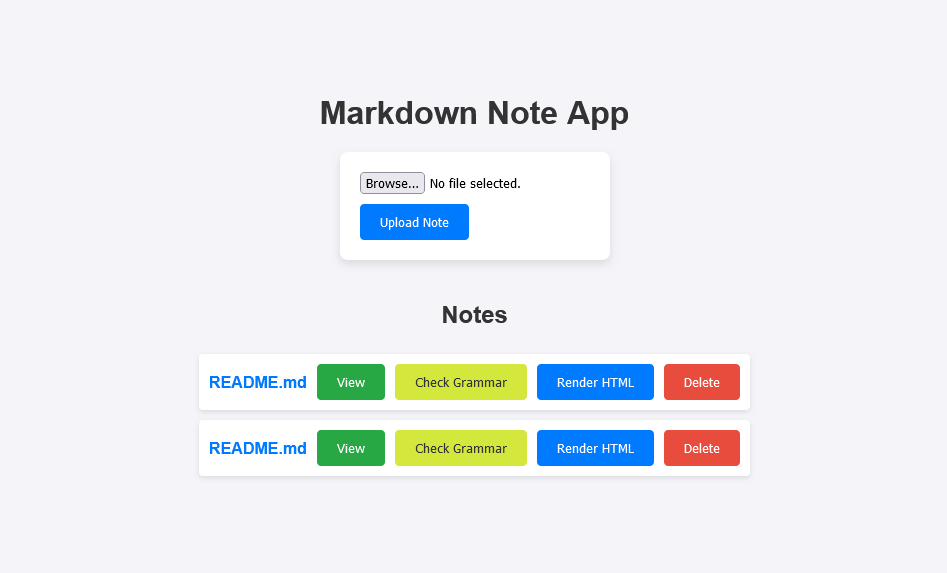

# Markdown Note-taking App

## Overview
A simple note-taking app that lets users upload markdown files, check the grammar, save the note, and render it in HTML. The goal of this project is to help you learn how to handle file uploads in a RESTful API, parse and render markdown files using libraries, and check the grammar of the notes.

- **Live link**: https://mntapp.onrender.com

## Features
- Created an endpoint to check the grammar of the note.
- Created an endpoint to save the uploaded file into the upload folder
- Created an endpoint to view the database content for a file upload
- Created an endpoint to list all the saved notes (i.e. uploaded markdown files).
- Return the HTML version of the Markdown note (rendered note) through another endpoint.

## Installation
To install and set up the Markdown Note-taking App, follow these steps:

1. **Clone the repository**:
   ```bash
   git clone https://github.com/PhilipOyelegbin/backend/tree/master/markdown-note-taking.git
   ```

2. **Install dependencies**:
   ```bash
   npm install
   ```

## Usage
After installation, you can use the following commands to manage your Markdown Note-taking App:

- **Start the application**:
  ```javascript
  node index.js
  ```
    or
  ```javascript
  npm start
  ```

## Example
Here's an example of how to use the Markdown Note-taking App:

```bash
# start the application
npm start

# access the web interface sing the port number in your terminal (e.g, http://localhost:3001)
```


## Contributing
Contributions are welcome! If you have any ideas, suggestions, or bug reports, please open an issue or submit a pull request.

## License
This project is licensed under the ISC License. See the [LICENSE](LICENSE) file for more details.

## Contact
For any questions or inquiries, please contact [contact@philipoyelegbin.com.ng](mailto:contact@philipoyelegbin.com.ng).
